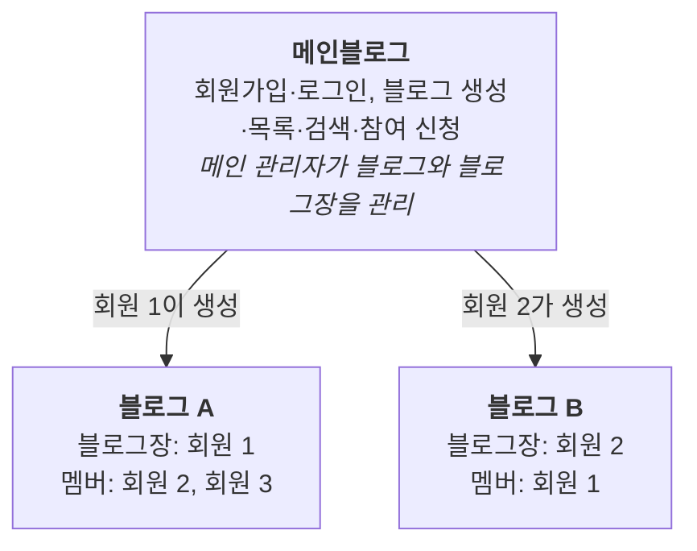

# 1. 개요

메인블로그는 회원가입, 로그인, 블로그 생성·참여를 담당하는 플랫폼입니다. 실제 글쓰기 공간은 회원이 만든 개별 블로그입니다. 이 문서는 메인블로그의 요구사항만 다룹니다. 개별 블로그 안의 기능은 별도 문서에서 확장합니다.

- **메인블로그**: 회원 계정, 블로그 생성과 참여, 소셜, 전체 관리
- **개별 블로그**: 회원이 만든 블로그. 만든 사람이 블로그장이 되고, 다른 회원이 참여할 수 있음
- **관리 구조**: 메인 관리자는 블로그와 블로그장을, 블로그장은 자기 블로그의 멤버를 관리

## 서비스 구조 (메인블로그와 개별 블로그 2개)

회원은 한 계정으로 블로그마다 다른 역할을 가집니다.

회원 2는 블로그 A에서는 멤버, 블로그 B에서는 블로그장입니다.

블로그장과 멤버는 계정 종류가 아니라 블로그별 역할이라서, 같은 회원이 블로그마다 다른 권한을 갖습니다.

| 구분 | 내용 |
|---|---|
| 목적 | 회원이 블로그를 만들고 함께 운영하는 블로그 플랫폼의 메인 기능 정의 |
| 범위 | 회원관리, 블로그 관리, 소셜, 공통 게시판, 메인 관리자, 비기능(보안) |
| 범위 밖 | 개별 블로그 내부 기능(블로그 꾸미기, 블로그별 카테고리, 블로그 멤버 등급 세부) |
