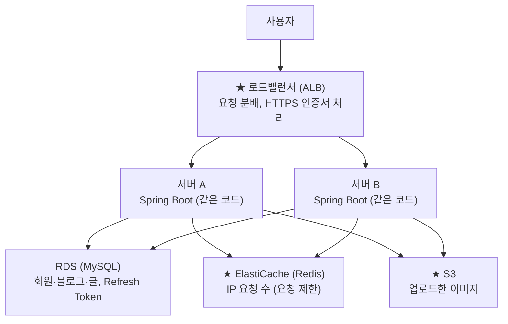

# 4. 비기능 요구사항

보안은 기능이 아니라 모든 기능에 걸리는 규칙입니다. [3장](03-functional-requirements.md)의 비고란이 여기 SEC 번호를 가리킵니다. 이 플랫폼에서 가장 중요한 항목은 **SEC-07**입니다. 한 회원의 역할이 블로그마다 다르기 때문입니다.

## 4.1 보안

| ID | 요구사항 | 적용 기능 |
|---|---|---|
| SEC-01 | 비밀번호는 bcrypt로 해시해 저장하고, 평문으로 저장하지 않는다. | USR-01 |
| SEC-02 | 비밀번호는 8~15자이고 영문·숫자·특수문자를 모두 포함하며, 대소문자를 구분한다(6.7). | USR-01, USR-07 |
| SEC-03 | 로그인을 5회 연속 실패하면 5분 동안 잠근다(6.7). | USR-03 |
| SEC-04 | 로그인은 JWT로 하고, 토큰은 JS가 읽을 수 없는 쿠키에 담는다(localStorage 금지). 짧게 유지되는 Access Token과 로그인을 이어 주는 Refresh Token을 함께 쓰고, 로그아웃·비밀번호 변경 때는 서버에서 Refresh Token을 폐기한다. 로그인 화면에 "로그인 유지" 체크박스를 둔다. 체크하지 않으면 토큰을 만료 시간 없는 세션 쿠키에 담아 브라우저를 닫으면 로그아웃되고, 30분 동안 활동이 없어도 로그아웃된다. 체크하면 14일 동안 유지된다. 로그아웃 버튼은 어느 경우든 즉시 로그아웃시킨다. 30분은 사용자가 직접 한 행동으로 서버에 요청이 갈 때(페이지 이동, 글·댓글 작성, 좋아요, 검색 등)마다 다시 시작된다. 알림 자동 확인처럼 저절로 가는 요청과 스크롤·마우스 움직임은 활동으로 세지 않는다. 글쓰기 화면에서는 입력이 있으면 몇 분마다 연장 요청을 보내고, 만료 5분 전에는 "로그인을 연장할까요?" 창을 띄운다. 쿠키는 HttpOnly·Secure로 설정한다. | USR-03, USR-04 |
| SEC-05 | 비밀번호 재설정 인증번호는 한 번만 쓸 수 있고 30분 뒤 만료되며, 5번 틀리면 무효가 된다. | USR-06 |
| SEC-06 | 입력값을 검증해 XSS와 SQL Injection을 막는다. 글 본문은 서버에서 jsoup으로 걸러 보내고, 화면은 사용자 입력을 textContent로 넣는다(7장 화면 방식). | BRD-01, BRD-06 |
| SEC-07 | 모든 요청에서 서버가 블로그별 역할(블로그장, 멤버)을 확인한다. A 블로그의 블로그장이 B 블로그를 관리할 수 없다. | BLG 전체, BRD-01 |
| SEC-08 | 업로드 파일의 확장자와 크기를 검사하고 실행 파일을 막는다. | BRD-05 |
| SEC-09 | 관리자 계정은 일반 회원 계정과 따로 만든다. 회원 계정에 관리자 권한을 붙이지 않는다. 저장은 같은 users 테이블에서 role = ADMIN으로 구분한다(D-90). 관리자는 이메일 대신 관리자 전용 아이디(예: admin01)로 관리자 로그인 화면에서 로그인한다(D-98). 관리자 계정은 회원가입 화면으로 만들 수 없고, 운영자가 DB나 초기 데이터로 만든다. 관리자 계정은 블로그 만들기·참여·글쓰기·댓글·좋아요·팔로우를 할 수 없고, 메인 공지(BRD-10)와 관리 기능만 쓴다. 관리자 활동은 모두 기록한다(ADM-06). | ADM 전체 |
| SEC-10 | 모든 통신은 HTTPS로 한다. 상태를 바꾸는 요청(POST·PUT·DELETE)은 Spring Security의 CSRF 토큰을 검사한다. 화면(JS)에서 보내는 요청은 토큰을 `X-XSRF-TOKEN` 헤더에 담아 보낸다. | 전체 |
| SEC-11 | Spring Security로 인증(로그인)과 인가(접근 권한)를 처리한다. 주소 단위로 비회원·회원·관리자를 나누고, 블로그별 역할(블로그장·부블로그장·멤버)은 메서드 보안(`@PreAuthorize`)으로 확인한다. | 전체, SEC-07 |
| SEC-12 | 보안 헤더를 설정한다. X-Frame-Options(다른 사이트가 화면을 프레임으로 심는 것 방지), X-Content-Type-Options: nosniff(파일 형식 위장 방지), Content-Security-Policy(허용한 곳의 스크립트만 실행), Strict-Transport-Security(HTTPS 강제), Referrer-Policy. | 전체, SEC-06 |
| SEC-13 | 로그인 실패가 반복되면 사람 확인(CAPTCHA, "사람입니까?")을 거치게 한다. 로그인을 3번 실패한 뒤부터 표시하고(6.7), 서비스는 Cloudflare Turnstile을 쓴다(7장). | USR-03 |

> **팀 결정: JWT + HttpOnly 쿠키** (D-53, 처음 정한 세션 + 쿠키(D-11)에서 변경)
>
> **고른 이유**
> - 서버를 여러 대로 늘려도 로그인 정보가 토큰 안에 있어 서버끼리 공유할 필요가 없음 (4.3 이중화 대비).
> - 토큰을 HttpOnly 쿠키에 담아 JS가 읽을 수 없으므로 XSS로 토큰을 훔치기 어려움.
>
> **세션 + 쿠키를 그만 쓴 이유**
> - 서버를 늘리면 Spring Session + Redis로 세션을 공유해야 함. 팀이 이중화를 미리 대비하기로 함.
>
> **구현할 때 지킬 것**
> - 로그아웃·비밀번호 변경을 바로 반영하려면 Refresh Token을 DB에 저장하고 폐기할 수 있어야 함 (D-82). 만료된 토큰은 매일 새벽 4시 배치에서 지움 (D-83).
> - 쿠키로 보내므로 CSRF 토큰은 계속 필요함 (SEC-10).
> - 정지·강퇴·블로그별 역할은 토큰 내용만 믿지 말고 요청마다 DB에서 확인함 (SEC-07). 토큰에는 회원 번호 정도만 담음.
> - 만료 시간은 "로그인 유지" 체크박스를 따름: 체크 안 하면 30분 무활동·브라우저 종료 시 로그아웃, 체크하면 14일 (SEC-04).

> **팀 결정: Spring Security로 보안 헤더, CSRF 토큰, 인증·인가를 처리합니다.** 자세한 규칙은 4.1의 SEC-10~12에 있습니다.
>
> **고른 이유**
> - 보안 중심이라는 팀 방향에 맞게 CSRF 토큰, 보안 헤더, 세션 고정 공격 방어가 기본으로 들어 있음.
> - 블로그별 역할 확인(SEC-07)을 `@PreAuthorize`로 메서드 위에 선언해서, 어느 기능에 어떤 권한이 필요한지 한눈에 보임.
> - 실무 표준이라 자료가 많고, 검증된 코드를 씀.
>
> **직접 구현을 쓰지 않은 이유**
> - 권한 확인을 기능마다 직접 넣으면 하나만 빠뜨려도 보안 구멍이 생김.
> - CSRF 방어와 보안 헤더를 직접 만들면 검증되지 않은 코드가 되고 시간도 더 듦.

## 4.2 성능·사용성

- **성능**: 메인 화면, 목록, 검색 결과는 1~2초 안에 응답한다(목표 1초, 늦어도 2초). 응답이 5초를 넘기면 기다리게 두지 않고 중단한 뒤 다시 시도하라고 안내한다.
- **사용성**: PC와 모바일 화면 모두에서 쓸 수 있어야 한다(반응형).
- **일관성**: 개별 블로그에서도 메인으로 돌아가는 상단 메뉴와 로그인 상태가 같게 보여야 한다.

## 4.3 확장성 (서버 이중화 대비)

1차는 서버 1대로 운영합니다. 다만 나중에 서버를 2대 이상으로 늘릴 때 코드를 거의 고치지 않도록, 아래 규칙을 지금부터 지킵니다. 서버가 여러 대면 요청이 어느 서버로 갈지 매번 달라서, 한 서버만 알고 있는 값은 다른 서버에서 사라집니다.

| ID | 개발 규칙 | 이유 |
|---|---|---|
| SCL-01 | 서버 메모리에 상태를 두지 않는다. 인증 코드, Refresh Token, 로그인 실패 횟수, 임시 데이터는 DB에 저장한다. IP별 요청 제한만 1차에 메모리에서 세고, 이중화 때 Redis로 옮긴다. | 서버 A가 저장한 값을 서버 B는 모름 |
| SCL-02 | 파일 저장은 `FileStorage` 인터페이스로 분리하고, 1차에는 디스크 구현만 쓴다. | 이중화할 때 S3 구현을 하나 추가하고 설정만 바꾸면 됨 |
| SCL-03 | `@Scheduled` 작업에는 처음부터 ShedLock을 건다. | 서버가 여러 대여도 한 서버에서만 실행되고, 1대일 때도 문제가 없음 |

### 이중화할 때 바뀌는 점

| 항목 | 서버 1대 (1차) | 서버 2대 이상 | 필요한 작업 |
|---|---|---|---|
| 로그인 (SEC-04, JWT) | 로그인 정보는 토큰 안에, Refresh Token만 DB에 저장 | 그대로. 모든 서버가 같은 DB의 Refresh Token을 봄 | 거의 없음 (JWT라 서버끼리 세션을 공유할 필요 없음) |
| 이미지 (7장 이미지 저장) | 서버 디스크 | S3 | S3 구현 하나 추가 (SCL-02) |
| 7일 뒤 폐쇄 배치 (BLG-09) | 서버 1대에서 실행 | 한 서버에서만 실행 | 없음 (SCL-03) |
| IP별 요청 제한 (7장 매크로 방지) | 서버 메모리에서 셈 | Redis에서 함께 셈 | 저장소를 Redis로 교체 |
| 사용자 IP·HTTPS 확인 (SEC-10, SEC-12) | 사용자에게서 직접 받음 | 로드밸런서를 거쳐서 옴 | 프록시 헤더(X-Forwarded-For, X-Forwarded-Proto)를 읽도록 설정 |
| 인증 코드, 조회수, 로그인 실패 횟수, 알림 | DB | DB | 없음 (SCL-01) |

프록시 헤더 설정은 로드밸런서를 붙일 때 함께 켭니다. 로드밸런서 없이 켜 두면 사용자가 헤더를 조작해 IP를 속일 수 있습니다.

### 이중화하면 새로 생기는 요구사항

- **가용성**: 서버 한 대가 멈춰도 서비스가 유지되어야 한다.
- **무중단 배포**: 배포 중에는 옛 버전과 새 버전 서버가 함께 돈다. DB를 바꿀 때 두 버전이 모두 동작하도록 단계적으로 바꾼다.
- **로그 모아보기**: 로그가 서버마다 흩어지므로 CloudWatch 같은 곳에 모은다.
- **비용**: 서버 2대, 로드밸런서, Redis가 각각 비용으로 잡힌다.

### 이중화에 필요한 기술

영역마다 선택지를 비교했고, AWS를 쓰고 팀이 인프라를 직접 관리하지 않는 방향으로 (추천)을 붙였습니다.

**1. 요청 나눠주기 (로드밸런서)**

| 선택지 | 장점 | 단점 |
|---|---|---|
| AWS ALB (추천) | 서버 상태를 검사해 죽은 서버로는 안 보냄. HTTPS 인증서를 대신 처리 | 사용 시간만큼 비용 |
| Nginx를 직접 설치 | 비용이 없고 설정을 마음대로 | Nginx 서버가 죽으면 전체가 멈춤. 직접 관리해야 함 |

**2. 서버 실행과 자동 확장**

| 선택지 | 장점 | 단점 |
|---|---|---|
| Elastic Beanstalk (추천) | jar 파일만 올리면 로드밸런서, 자동 확장, 롤링 배포를 한 번에 구성. 가장 쉬움 | 세밀한 제어가 어렵고 AWS에 묶임 |
| ECS Fargate + Docker | 컨테이너라 로컬과 서버 환경이 같음. 실무에서 많이 씀 | Docker와 ECS 개념을 배워야 함 |
| EC2 + Auto Scaling 직접 구성 | 모든 걸 마음대로 | 설정할 것이 가장 많고 실수하기 쉬움 |

**3. 로그인 토큰 저장 (SEC-04, JWT)**

| 선택지 | 장점 | 단점 |
|---|---|---|
| DB(MySQL)에 Refresh Token 저장 (채택, D-82) | 이미 쓰는 DB라 추가 비용이 없음. 서버를 늘려도 모든 서버가 같은 DB를 보므로 바꿀 것이 없음. 서버를 다시 켜도 폐기 기록이 남음 | 토큰을 새로 받을 때마다 DB를 한 번 읽음(Access Token이 만료될 때만이라 부담은 작음). 만료된 토큰은 매일 새벽 4시 배치가 지움 (D-83) |
| Redis에 Refresh Token 저장 | 빠르고, 만료 시간이 지나면 Redis가 알아서 지움 | 서버 1대인 1차에도 Redis를 따로 띄워야 해서 비용과 관리할 것이 늘어남 |
| 서버에 저장하지 않음 | 구현이 가장 간단함 | 로그아웃·비밀번호 변경 뒤에도 훔친 Refresh Token을 만료 때까지 쓸 수 있어 USR-04를 지킬 수 없음 |

세션 공유 방식(Spring Session + Redis, Spring Session JDBC, 스티키 세션)은 로그인을 JWT로 정하면서(D-53) 필요 없어져 표에서 뺐습니다. 비교한 이유는 8장 D-53에 남아 있습니다.

**4. 파일 저장소 (7장 이미지 저장)**

| 선택지 | 장점 | 단점 |
|---|---|---|
| S3 (추천) | 용량 걱정이 없고 저렴함. 나중에 CDN(CloudFront)을 붙이기 쉬움 | 업로드 코드를 S3 SDK로 바꿔야 함 (SCL-02로 대비) |
| EFS (서버끼리 공유하는 디스크) | 코드를 거의 안 바꿈. 폴더 경로만 연결 | S3보다 비싸고 느림 |

**5. 서버 간 공유가 필요한 작업 (BLG-09 폐쇄 처리, 7장 매크로 방지)**

| 영역 | 선택지 | 장점 | 단점 |
|---|---|---|---|
| 스케줄러 중복 방지 | ShedLock + DB (추천) | 어노테이션 하나로 끝남. 있는 DB를 씀 | 아주 정밀한 예약 작업에는 약함 |
| 스케줄러 중복 방지 | Quartz 클러스터 | 예약 작업을 정교하게 관리 | 테이블이 많고 설정이 복잡함 |
| IP 요청 제한 | Bucket4j + Redis (추천) | 지금 코드에서 저장소만 바꿈 | Redis가 필요함 (이중화할 때 ElastiCache를 추가) |
| IP 요청 제한 | AWS WAF | 코드 없이 로드밸런서 앞에서 막음 | 규칙마다 비용. 계정별 제한 같은 세밀한 규칙은 어려움 |

**6. DB**

| 선택지 | 장점 | 단점 |
|---|---|---|
| RDS for MySQL (추천) | 백업, 장애 복구, 패치를 AWS가 해 줌 | 직접 설치보다 비쌈 |
| Aurora MySQL | 더 빠르고 읽기 전용 복제본을 쉽게 늘림 | 이 규모에는 비용이 과함 |
| EC2에 MySQL 직접 설치 | 가장 저렴함 | 백업과 장애 복구를 직접 해야 함 |

**7. DB 변경 관리 (무중단 배포용)**

| 선택지 | 장점 | 단점 |
|---|---|---|
| Flyway (추천) | DB 변경을 SQL 파일로 버전 관리. 여러 서버가 동시에 떠도 한 번만 적용됨 | SQL을 직접 써야 함 |
| Liquibase | DB 종류에 덜 의존하고 되돌리기 기능이 있음 | XML·YAML 문법을 배워야 함 |
| JPA ddl-auto=update (지금 방식) | 설정 한 줄 | 서버 여러 대가 동시에 테이블을 바꾸려 할 수 있고 변경 기록이 없어, 운영에서는 쓰면 안 됨 |

**8. 배포 자동화**

| 선택지 | 장점 | 단점 |
|---|---|---|
| GitHub Actions (추천) | 저장소에 바로 붙고, 빌드·테스트·배포를 파일 하나로 관리 | 무료 사용 시간에 한도가 있음 |
| Jenkins | 기능과 플러그인이 많음 | Jenkins 서버를 따로 운영해야 함 |
| AWS CodePipeline | AWS 안에서 끝남 | 설정이 복잡하고 AWS에 묶임 |

**9. HTTPS 인증서**

| 선택지 | 장점 | 단점 |
|---|---|---|
| AWS Certificate Manager (추천) | ALB에 붙이면 무료이고 자동 갱신 | AWS 밖에서는 못 씀 |
| Let's Encrypt | 무료이고 어디서나 씀 | 90일마다 갱신을 직접 자동화해야 함 |

**10. 로그·모니터링**

| 선택지 | 장점 | 단점 |
|---|---|---|
| CloudWatch (추천) | Beanstalk·ECS 로그가 자동으로 모임. 경보 설정 가능 | 검색과 화면이 불편하고, 로그가 많으면 비용이 늘어남 |
| Spring Actuator + Prometheus + Grafana | 서버 상태를 그래프로 보기 좋고 무료 | 모니터링 서버를 따로 운영해야 함 |
| ELK (Elasticsearch, Logstash, Kibana) | 로그 검색이 강력함 | 무겁고 운영이 어려움 |

### 서버 2대 구성 (추천 기술 기준)

서버 A와 B는 같은 코드를 돌리고, 데이터(Refresh Token 포함)·IP 요청 수·이미지는 서버 밖의 저장소 세 곳을 함께 씁니다. 그래서 요청이 어느 서버로 가도 결과가 같습니다.

## 4.4 개인정보 가려서 보여주기 (마스킹)

누가 보느냐에 따라 보여주는 항목과 가리는 정도를 정합니다. 비밀번호는 어느 화면에도 칸 자체가 없습니다. **가리는 처리는 화면(JS)이 아니라 서버가 응답을 만들 때 합니다.** 화면에서만 가리면 API 응답에 원래 값이 남아 개발자 도구로 누구나 볼 수 있기 때문입니다.

| 보는 사람 | 보이는 항목 | 표시 방식 | 상태 |
|---|---|---|---|
| 본인 (내 정보) | 이메일, 이름, 닉네임, 전화번호 | 모두 그대로 | 확정 |
| 블로그장 (멤버 관리 화면) | 이메일, 이름, 닉네임, 전화번호 | 이메일·전화번호는 가림 | 확정 |
| 부블로그장 (멤버 관리 권한을 받은 경우) | 이메일, 이름, 닉네임, 전화번호 | 블로그장과 같이 이메일·전화번호는 가림. 멤버 관리 권한이 없으면 멤버 정보를 볼 수 없음 | 확정 |
| 다른 회원 (프로필) | 닉네임, 프로필 사진, 소개 | 이메일·이름·전화번호는 보이지 않음 | 확정 |
| 메인 관리자 | 이메일, 이름, 닉네임, 전화번호 | 기본은 가림. "전체 보기"를 누르면 보이고, 누른 기록을 남김(ADM-06) | 확정 |
| 이메일 찾기 결과 (USR-08) | 이메일 | 가림 | 확정 |

### 가리는 형식

| 항목 | 규칙 | 예시 |
|---|---|---|
| 이메일 | @ 앞의 처음 2글자만 보이고 나머지는 \*\*\*. @ 앞이 2글자 이하면 첫 글자만 보임 | abcdef@gmail.com → ab\*\*\*@gmail.com |
| 전화번호 | 가운데 4자리를 가림 | 010-1234-5678 → 010-\*\*\*\*-5678 |

## 4.5 데이터 보관·삭제

삭제·탈퇴·폐쇄된 데이터는 30일 동안 보관한 뒤 완전히 지웁니다. 30일 동안은 화면에 보이지 않습니다. 완전 삭제는 폐쇄 처리와 같은 매일 새벽 4시 배치(BLG-09 아래 폐쇄 처리)가 함께 합니다. 만료된 Refresh Token도 같은 배치에서 지웁니다(D-83).

| 대상 | 30일을 세는 기준 | 30일 동안 | 30일 뒤 |
|---|---|---|---|
| 탈퇴한 회원의 개인정보 (이메일·이름·전화번호·닉네임·프로필 사진) | 탈퇴한 날 | 로그인 불가, 화면에 안 보임. 로그인용 이메일은 탈퇴 즉시 비워 같은 이메일로 바로 재가입 가능(6.5) | 개인정보 삭제. 쓴 글은 "탈퇴한 회원"으로 남음 |
| 삭제한 글·댓글·사진 | 삭제한 날 | 안 보임. 실수나 잘못된 삭제는 관리자가 복구 가능 | 완전 삭제 |
| 폐쇄된 블로그 (글·사진·카테고리) | 폐쇄된 날 | 안 보임 | 글·사진·카테고리·블랙리스트는 완전 삭제. 블로그 주소는 비워서 다른 사람이 쓸 수 있음. 블로그 행 자체는 남겨 1년 보관하는 제재·신고 기록이 어느 블로그 것인지 알 수 있게 함(D-86) |
| 알림 | 받은 날 | 알림함에 보임 | 삭제. 내 정보에서 7일로 줄이거나 직접 일괄 삭제 가능(6.7) |

### 30일 규칙의 예외

| 대상 | 보관 | 이유 |
|---|---|---|
| 인증번호, 임시 토큰 | 만료되거나 쓰면 바로 삭제 | 다시 쓸 일이 없고, 남아 있으면 악용될 수 있음 |
| 블로그 블랙리스트 (BLG-11) | 그 블로그가 있는 동안 블로그 안에 보관(원문 대신 해시). 블로그장이 바뀌어도 새 블로그장과 부블로그장은 열람만 가능 | 강퇴한 사람이 탈퇴 후 재가입해도 막아야 함 |
| 관리자 활동·신고·경고·정지 기록 | 1년 | 경고 3회 누적(ADM-07), 정지 3회(BLG-13)처럼 이력을 세야 하고, 분쟁이 생기면 확인해야 함 |

## 4.6 개인정보 처리

이름과 전화번호를 받으므로 가입할 때 개인정보 수집·이용 동의를 받습니다. 필요한 만큼만 받고, 목적이 끝나면 4.5에 따라 지웁니다. 실제 서비스로 공개하기 전에는 법률 검토를 받는 것을 권합니다.

| 항목 | 구분 | 쓰는 곳 |
|---|---|---|
| 이메일 | 필수 | 로그인 아이디, 인증번호·안내 메일 |
| 비밀번호 | 필수 | 로그인. bcrypt 해시로만 저장하고 원문은 저장하지 않음(SEC-01) |
| 이름 | 필수 | 이메일 찾기(USR-08), 블랙리스트 해제 문의 때 본인 확인(BLG-12) |
| 닉네임 | 필수 | 글·댓글·프로필에 표시 |
| 전화번호 | 필수 | 이메일 찾기(USR-08), 블랙리스트(BLG-11, 12) |
| 프로필 사진, 소개 | 선택 | 프로필에 표시 |
| 접속 IP, 브라우저 정보, 세션 쿠키 | 자동 수집 | 로그인 유지, 비밀번호 대입·스팸 방지(요청 제한) |

| 정할 것 | 내용 |
|---|---|
| 동의 방법 | 가입 ③단계에서 [필수] 이용약관, [필수] 개인정보 수집·이용 동의를 각각 체크박스로 받고, 동의한 시각을 저장한다 |
| 보관 기간 | 탈퇴 후 30일 뒤 삭제(4.5). 블랙리스트는 원문 대신 해시로만 보관 |
| 다른 곳에 주는지 | 판매나 제공은 하지 않음. 메일 발송 서비스(예: Gmail SMTP)는 메일을 보내는 데만 씀 |
| 본인의 권리 | 내 정보에서 열람, 수정(닉네임·전화번호·비밀번호), 탈퇴 |
| 보호 방법 | HTTPS(SEC-10), 비밀번호 해시(SEC-01), 보는 사람에 따라 가려서 표시(4.4), 관리자 열람 기록(ADM-06) |
| 안내 | 모든 화면 아래에 개인정보 처리방침 링크를 둔다 |
